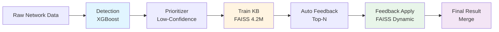

# FEED-NIDS: 다단계 피드백 학습 기반 네트워크 침입 탐지 시스템

**FEED-NIDS (Feedback-Enhanced Ensemble Detection for Network Intrusion Detection Systems)**

[](https://www.python.org/downloads/)
[](LICENSE)

> FAISS 벡터 유사도 기반 동적 지식 증강 기술을 적용한 다단계 네트워크 보안 탐지 시스템

---

## 🎯 개요

FEED-NIDS는 머신러닝 기반 네트워크 침입 탐지 시스템으로, 다단계 파이프라인을 통해 점진적으로 탐지 정확도를 향상시킵니다. FAISS 벡터 검색 엔진을 활용하여 대규모 지식 베이스(4.2M+ 케이스)와 동적 피드백 코퍼스를 효율적으로 관리하며, 인간 분석가의 피드백을 시스템에 자동으로 반영합니다.

### 핵심 성과
- ✅ **Detection Only**: 기본 XGBoost 탐지 (베이스라인)
- ✅ **Detection + KB**: Train 데이터 기반 지식 적용 (~95% 자동 해결)
- ✅ **Detection + KB + Feedback**: 분석가 피드백 반영 (최종 정확도 향상)

---

## ⭐ 주요 특징

### 1. 다단계 파이프라인 아키텍처
```
Detection → Prioritizer → Train KB → Feedback → Final Result
```

### 2. FAISS 벡터 검색 최적화
- **22개 네트워크 보안 Feature + SHAP Top-5** 복합 벡터 (44차원)
- **GPU 가속** 지원 (IVF 인덱스)
- **캐시 시스템**: 해시 기반 자동 재구축
- **배치 처리**: 1000개 케이스를 1번의 FAISS 호출로 처리

### 3. 동적 피드백 증축
- 분석가 검토 케이스 자동 감지
- FAISS 인덱스 실시간 재구축
- Round_1: 초기 코퍼스 구축 → Round_2+: 증축 적용

### 4. 지능형 우선순위 선정
- **Gating Score**: `α × Attack_Probability + β × Statistical_Score`
- DoS/Port Scan 자동 탐지
- SHAP 기반 설명 가능성

---

## 🏗️ 시스템 아키텍처



### 파이프라인 흐름

| Phase | 입력 | 처리 | 출력 |
|-------|------|------|------|
| **0️⃣ Detection** | `Round_*.csv` | XGBoost 예측 | `*_with_predictions.csv` |
| **1️⃣ Prioritizer** | 예측 결과 | Gating Score 계산 | `*_low_confidence_cases.csv` |
| **2️⃣ Train KB** | Low-Confidence | FAISS 유사도 매칭 | `*_kb_applied.csv` |
| **3️⃣ Auto Feedback** | KB 미적용 | 자동 라벨 복사 | 피드백 파일 업데이트 |
| **4️⃣ Feedback Apply** | KB 미적용 | FAISS 피드백 적용 | `*_position_aware_optimal.csv` |
| **5️⃣ Merge** | 원본 + 적용 결과 | 병합 | `*_with_predictions_applied.csv` |

---

## 🚀 설치 방법

### 필수 요구사항
- Python 3.8 이상
- CUDA 11.0+ (GPU 사용 시)

### 1. 저장소 클론
```bash
git clone https://github.com/your-repo/feed-nids.git
cd feed-nids
```

### 2. 의존성 설치
```bash
# CPU 버전
pip install -r requirements.txt

# GPU 버전 (CUDA 11.x)
pip install faiss-gpu
pip install -r requirements.txt
```

### requirements.txt
```txt
pandas>=1.3.0
numpy>=1.21.0
scikit-learn>=1.0.0
xgboost>=1.5.0
joblib>=1.1.0
shap>=0.41.0
faiss-cpu>=1.7.0  # CPU 버전
# faiss-gpu>=1.7.0  # GPU 버전 (별도 설치)
```

---

## 📁 디렉토리 구조

```
feed-nids/
├── pipeline_orchestrator_v2.py    # 메인 실행 파일
├── tools/                          # 파이프라인 모듈
│   ├── base.py                     # 공통 인터페이스
│   ├── detection.py                # Detection 모듈
│   ├── prioritizer.py              # Prioritizer 모듈
│   ├── knowledge_base.py           # Train KB 관리
│   ├── feedback_base.py            # Feedback 관리
│   ├── kb_similarity_apply_tool_optimized.py  # KB 적용
│   ├── similarity_apply_faiss.py   # Feedback 적용
│   ├── auto_feedback.py            # 자동 피드백
│   └── merge.py                    # 결과 병합
├── models/                         # 학습된 모델
│   └── xgboost_binary_classifier.joblib
├── tools/Train_Cases/              # 지식 베이스 (4.2M)
│   ├── train_case_1.csv
│   ├── train_case_2.csv
│   └── ...
├── test_rounds/                    # 입력 데이터
│   ├── Round_1.csv
│   ├── Round_2.csv
│   └── ...
├── cache/                          # FAISS 캐시 (자동 생성)
├── feedback_cases/                 # 피드백 케이스 (자동 생성)
├── round_predictions/              # Detection 결과 (자동 생성)
├── kb_applied_round_predictions/   # KB 적용 결과 (자동 생성)
├── round_predictions_applied/      # 최종 결과 (자동 생성)
└── README.md
```

---

## 💻 사용 방법

### 🔥 빠른 시작 (Full Pipeline)

```bash
# 모든 라운드 전체 파이프라인 실행
python pipeline_orchestrator_v2.py --all

# 특정 라운드만 실행
python pipeline_orchestrator_v2.py --rounds Round_1 Round_2 Round_3

# GPU 가속 활성화
python pipeline_orchestrator_v2.py --all --kb-use-gpu --fb-use-gpu
```

### 📋 실행 모드

#### 1️⃣ Full Mode (전체 파이프라인)
```bash
python pipeline_orchestrator_v2.py \
    --mode full \
    --all \
    --kb-use-gpu \
    --fb-use-gpu
```

#### 2️⃣ KB Only Mode (Train KB만 적용)
```bash
python pipeline_orchestrator_v2.py \
    --mode kb-only \
    --rounds Round_1 Round_2
```

#### 3️⃣ Feedback Only Mode (Feedback만 적용)
```bash
python pipeline_orchestrator_v2.py \
    --mode feedback-only \
    --rounds Round_2 Round_3
```

---

## ⚙️ 주요 파라미터

### Detection 파라미터
```bash
--skip-detection           # Detection 단계 스킵
--force-detection          # 기존 결과 무시하고 재실행
--det-threshold 0.5        # 공격/정상 분류 임계값
```

### Train KB 파라미터
```bash
--kb-alpha 0.3             # IP 유사도 가중치
--kb-beta 0.4              # Cosine 유사도 가중치
--kb-gamma 0.3             # SHAP Overlap 가중치
--kb-threshold 0.9         # KB 적용 임계값 (높게 설정)
--kb-use-gpu               # GPU 가속
--kb-faiss-k 500           # FAISS Stage 1 후보 개수
```

### Prioritizer (Gating) 파라미터
```bash
--gate-alpha 0.3           # Attack Probability 가중치
--gate-beta 0.7            # Statistical Score 가중치
--gate-bottom-percent 5.0  # 하위 5% 선택
--gate-top-k 300           # 또는 고정 300개 선택
```

### Auto Feedback 파라미터
```bash
--skip-auto-feedback       # 자동 피드백 비활성화
--auto-top-n 300           # 상위 300개 자동 라벨링
```

### Feedback Apply 파라미터
```bash
--alpha 0.3                # IP 유사도 가중치
--beta 0.4                 # Cosine 유사도 가중치
--gamma 0.3                # SHAP Overlap 가중치
--threshold 0.8            # Feedback 적용 임계값 (KB보다 낮게)
--fb-use-gpu               # GPU 가속
--faiss-k 900              # FAISS Stage 1 후보 개수
```

---

## 🔄 파이프라인 상세

### Phase 0️⃣: Detection
```bash
입력: ./test_rounds/Round_*.csv
동작: XGBoost로 Attack/Normal 예측
출력: ./round_predictions/Round_*_with_predictions.csv
```

**출력 컬럼:**
- `attack_probability`: 공격 확률 (0~1)
- `normal_probability`: 정상 확률 (0~1)
- `predicted_label`: 예측 라벨 (Attack/Normal)
- `prediction_confidence`: 예측 신뢰도 (0~1)
- `is_correct`: 정답 여부 (label 존재 시)

---

### Phase 1️⃣: Prioritizer (분석 대상 추출)
```bash
입력: ./round_predictions/Round_*_with_predictions.csv
동작: Gating Score로 Low-Confidence Attack 케이스 선정
출력: ./feedback_cases/Round_*_low_confidence_cases.csv
```

**Gating Score 계산:**
```python
confidence_score = α × attack_probability + β × statistical_score

statistical_score = (DoS_flag + PortScan_flag) / 2
- DoS_flag = 1 if (flow_count >= 50 and unique_ports < 2)
- PortScan_flag = 1 if (unique_ports >= 50 and flow_count >= 50)
```

**SHAP 분석:**
- Top-5 중요 Feature 추출
- 설명 가능한 AI 구현

---

### Phase 2️⃣: Train Knowledge Base (FAISS)
```bash
입력: ./feedback_cases/Round_*_low_confidence_cases.csv
동작: 4.2M Train Cases에서 FAISS 유사도 매칭
출력: ./kb_applied_round_predictions/Round_*_kb_applied.csv
```

**복합 유사도 계산:**
```python
S_score = α × IP_similarity + β × Cosine_similarity + γ × SHAP_overlap

# IP 유사도
IP_similarity = 1.0 if (A_ip, B_ip) 일치 else 0.0

# Cosine 유사도 (22개 Feature)
Cosine_similarity = (query · kb_vector) / (||query|| × ||kb_vector||)

# SHAP Overlap (22개 Feature One-Hot)
SHAP_overlap = Σ rank_weight(|query_rank - kb_rank|) / min(|query|, |kb|)
```

**적용 조건:**
- `S_score >= 0.9` (높은 임계값)
- KB 우선순위 > Feedback

---

### Phase 3️⃣: Auto Feedback
```bash
입력: ./feedback_cases/Round_*_low_confidence_cases.csv
동작: KB 미적용 케이스 중 Top-N을 실제 라벨로 자동 피드백
출력: 입력 파일 업데이트 (덮어쓰기)
```

**자동 피드백 조건:**
- `reviewed = False` (미검토)
- `confidence_score` 낮은 순
- Top-N (기본 300개)

**업데이트 필드:**
- `feedback_label = label` (실제 라벨 복사)
- `feedback_confidence = 5`
- `feedback_reason = "(자동) 실제 라벨 기반 자동 피드백"`
- `reviewed = True`

---

### Phase 4️⃣: Feedback Apply (FAISS 동적 증축)
```bash
입력: ./kb_applied_round_predictions/Round_*_kb_applied.csv
동작: KB 미적용 케이스에 Feedback 코퍼스 적용 (FAISS)
출력: ./round_predictions_applied/Round_*_position_aware_optimal.csv
```

**동적 증축 메커니즘:**
```python
Round_1: 초기 300개 코퍼스 구축 → 적용 스킵
Round_2: Round_1 300개 활용 → FAISS 재구축 → 적용
Round_3: Round_1 + Round_2 피드백 누적 → 적용
```

**적용 조건:**
- `kb_applied = False` (KB 미적용)
- `S_score >= 0.8` (KB보다 낮은 임계값)

---

### Phase 5️⃣: Merge (최종 결과)
```bash
입력: 
  - ./round_predictions/Round_*_with_predictions.csv
  - ./round_predictions_applied/Round_*_position_aware_optimal.csv
동작: 원본 예측 + KB/Feedback 적용 결과 병합
출력: ./round_predictions/Round_*_with_predictions_applied.csv
```

**최종 라벨 결정:**
```python
final_label = adjusted_label if adjusted_label else predicted_label
```
---

## 📊 결과 분석

### 출력 파일 구조
```
round_predictions/
├── Round_1_with_predictions.csv              # Detection 결과
└── Round_1_with_predictions_applied.csv      # 최종 결과 (★)

kb_applied_round_predictions/
└── Round_1_kb_applied.csv                    # KB 적용 결과

round_predictions_applied/
└── Round_1_position_aware_optimal.csv        # Feedback 적용 결과

feedback_cases/
└── Round_1_low_confidence_cases.csv          # 분석 대상 케이스
```

### 주요 컬럼 설명

**최종 결과 파일** (`*_with_predictions_applied.csv`)
```
- predicted_label: XGBoost 예측
- kb_applied_label: Train KB 적용 결과
- adjusted_label: KB/Feedback 최종 적용 라벨
- final_label: 최종 판정 (adjusted_label or predicted_label)
- kb_applied: KB 적용 여부
- feedback_applied: Feedback 적용 여부
- applied_similarity_score: 유사도 점수
```

---
**FEED-NIDS** - 지능형 네트워크 보안을 위한 차세대 침입 탐지 시스템 🛡️
